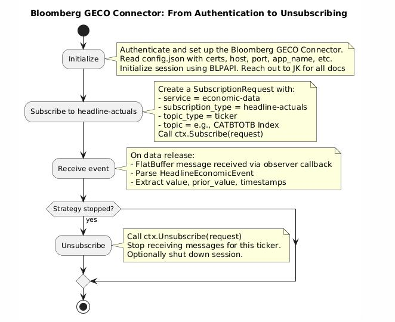

#BlpConn : B - PIPE Connector

BlpConn is a high-performance C++/Go library for working with the Bloomberg
Market Data Feed (B-PIPE). At this moment, BlpConn focuses on retrieving data
from Bloomberg's economic data feed (`//blp/economic-data`).

## Workflow



The above diagram shows the workflow to retrieve real-time data from Bloomberg
B-PIPE. The process is as follows:

1. **Initialize**: A session to connect to Bloomberg's services is created. The
   session is responsible for managing the connection and communication with
   the server. The session opens a service. A service is a specific
   functionality provided by Bloomberg. In this case, the service is
   `//blp/economic-data`.
2. **Subscribe**: The client program sends a subscription request to the
   service. The request contains the information about the data the client
   wants to receive. The request is sent to the server, and responses are
   received asynchronously.
3. **Observe**: The client program registers one or more observer functions.
   These functions are called when the server sends notifications about the
   service status and the subscription data. The observer functions are
   responsible for processing the notifications and updating the client program
   with the new data.
4. **Unsubscribe**: The client program can unsubscribe from the service at any
   time. Subscriptions are identified by a correlation ID assigned by the
   client program. The correlation ID is used to identify the subscription and
   unsubscribe from it. The client program can also close the session, which
   will automatically unsubscribe from all services and close the connection to
   the server.
5. **Shutdown**: The client program can shut down the service at any time. This
   will close the connection to the server and free up any resources used by
   the session. The client program can also shut down the service when it is no
   longer needed. This will close the connection to the server and free up any
   resources used by the session.

## Application Context

The first step is to initialize a context, which includes:

* Setting the authentication parameters
* Opening a session
* Activating the default service: `//blp/economic-data`

Once the the connection has been initialized, the client program can start
subscribing to data feeds and managing responses and notifications.

The session should be shutdown when the client program is finished. In C++, if
the context is active at the end of the program, it will be shutdown
automatically. In Go, the context must be shutdown explicitly using `defer`.

During the client program execution, a context can be initialized and shutdown
as many times as needed. This can be helpfull if for any reason the connection
to the Bloomberg servers is lost. There are two mechanisms the client can use
to monitor the context status:

* The function `isConnected()` which returns true if the context is connected
  to the server.
* Monitoring log messages of type `Hearbeat`, which are sent periodically by
  the server to indicate that the connection is still active. More about
  processing notifications below.

Here is an example of managing the applcation context:

```go
package main

import (
    "blpconngo"
    "log"
)

func main() {
    ctx := blpconngo.NewContext()
    ctx.AddNotificationHandler(blpconngo.Callback)
    configPath : = "./config.json"
    res := ctx.InitializeSession(configPath)
    if !res{log.Fatal(
        "Failed to initialize session")
    }
    defer ctx.ShutdownSession()
    // The session is now active and ready to process subscription requests
}
```

## Configuration

In the previous section, the first step on initializing the context is settin
the authetication parameters .Those and other application global values are
defined in a configuration file .The path of the configuration file is passed
to the `InitializeSession` function .The configuration file is a JSON file.A
`config - example.json` file is included with source code.

This is an example of a configuration file :

```json
{
  "client_certificate" : "./credentials/client_certificate.pk12",
  "root_certificate" : "./credentials/root_certificate.pk7",
  "password" : "PASSWORD",
  "primary_host" : "bloomberg-server1",
  "secondary_host" : "bloomberg-server2",
  "port" : 8194,
  "default_service" : "//blp/economic-data",
  "app_name" : "TraderApp:MarketData",
  "mode" : "prod"
}
```

In this case, it is assumed that the certificates are located in the folder `./
credentials`.

Parameters to define are:

* `client_certificate`: Path to the file with the client certificate
* `root_certificate`: Path to the file with the root certificate
* `password`: Password to access Bloomberg's services
* `primary_host`: Name of Bloomberg's primary host
* `secondary_host`: Name of Bloomberg's secondary host
* `port`: Server port to access the services
* `default_service`: Default service identification
* `app_name`: Bloomberg's designated application name
* `mode`: Mode of operation. It can be `prod` or `test`

**Note** : The `mode` configuration parameter only has effect if the code has
been compiled with the `ENABLE_PROFILING` option .

## Subscription Request

The main task provided by the library is let the client to subscribe /
unsubscribe to real time data about economic events .The characteristics of the
required information are defined in a subscription request .Once the
subscription has been activated, your application will start receiving updates
and notifications about your request .

A request contains :

* `service`: One of the services offered by Bloomberg.At this moment, the only
  service enabled is `economic - data`.
* `subscription_type`: A category of information, such as a calendar of
  releases or economic headlines.
* `topic_type`: The standard used to encode the entity or security you are
  requesting information about . The most commonly used is "Ticker." Other
  types include CUSIP and FIGI.
* `topic`: The specific identifier that represents the entity or security you
  are requesting information about.
* `options`: Some requests may require complementary information, such as a
  period of time. This attribute is used to encode those additional parameters.
* `correlation_id`: A number to identify the request.This number must be
  assigned by the user.

As an example, this is the definition of a subscription request:

```c++ struct SubscriptionRequest {
  std::string service;
  std::string topic;
  TopicType topic_type = TopicType::Ticker;
  SubscriptionType subscription_type = SubscriptionType::HeadlineActuals;
  std::string options = "";
  uint64_t correlation_id = 0;
}
```

The correlation ID is required to follow up the request.Related notifications
will be tagged with the same correlation ID. The client program can use this ID
to identify the request and process the notifications accordingly.Moreover, to
stop the subscription, the correlation ID is link to the original request.

For subscription and topic types, the library provides predefined enumerations
with valid values.

```c++
enum class SubscriptionType {
      HeadlineActuals,
      ReleaseCalendar,
      HeadlineSurveys
    };

enum class TopicType {
  Ticker,
  Cusip,
  Figi,
};
```

Here is an example on creating a subscription request in Go:

```go
...
import "blpconngo"
...
// `ctx` An initialized BlpConn context
request := blpconngo.NewSubscriptionRequest()
request.SetTopic("INJCJC Index")
request.SetSubscription_type(blpconngo.SubscriptionType_ReleaseCalendar)
request.SetCorrelation_id(4)
ctx.Subscribe(request)
// The subscription remains active
ctx.Unsubscribe(request)
```

## Observer Functions 

To receive notifications, the library requires the client program to register
one or more observer functions. An observer function is be used as a callback:
every time a new event occurs, a notification will be delivered to the client
program.

```c++
void observer(uint8_t *buffer, size_t len)
```

Notifications are delivered as [FlatBuffers](https://flatbuffers.dev/) binary
sequences. FlatBuffers is a high-performance serialization format and library.
The client program is responsible for implementing mechanisms to deserialize
the data.  Examples of deserialization functions are provided below.

In C++ and Go, default observer functions are provided. They catch all notitications
and print them to the standard output.

This how to register an observer function in C++:

```c++
void defaultObserver(const uint8_t *buffer, size_t size) {
    // convert binary buffer to messages and print
    // them to the console.
}

...
ctx.AddNotificationHandler(defaultObserver);
...
```

Notifications can be any of the following types:

* `LogMessage`: A general message.
* `HeadlineEconomicEvent`: A message related to an economic event.
* `HeadlineCalendarEvent`: A message related to a calendar event.

## Log Messages

`LogMessage` is the general mechanism to inform the client about the status of
the session, service, and subscriptions.  A log message contains the following
fields:

* `module`: The module that generated the message.
* `status`: An indication about the status of the module or an event.
* `correlation_id`: The correlation ID of the subscription that generated the message.
* `message`: A human-readable message.

It is expected that the client program will receive log messages and take
appropiate actions in response to them. For example, if the session is down, the
client program should try to reconnect. If the subscription is terminated, the
client program should try to resubscribe. If the service is closed, the client
program should try to reopen the service.

The `module` field can take any of this values:

```c++
enum class Module: uint8_t {
    Unknown = 0,
    System,
    Session,
    Subscription,
    Service,
    Heartbeat,
    Another = 99,
};
```

The module `Session` can take the following values:

```c++
enum class SessionStatus: uint8_t {
    Unknown = 0,
    ConnectionUp,
    Started,
    ConnectionDown,
    Terminated,
    InvalidOptions,
    Failure,
    Another = 99,
};
```

The moduel `Service` can take the following values:

```c++
enum class ServiceStatus: uint8_t {
    Unknown = 0,
    Opened,
    Closed,
    Failure,
    Another = 99,
};
```

The module `Subscription` can take the following values:

```c++
enum class SubscriptionStatus: uint8_t {
    Unknown = 0,
    Started,
    StreamsActivated,
    Terminated,
    Success,
    Failure,
    Another = 99,
};
```
The `Heartbeat` module is used to indicate that the session is still active. The
remaining fields are not used in this case.

## Economic Events

Related to the data messages, all economic events share these fields:

* `id_bb_global`: A Bloomberg global ID
* `parsekyable_des`: Encoded description
* `description`: Human-readable description
* `event_type`
* `event_subtype`
* `event_id`: An identification number
* `observation_period`: The time frame the event corresponds to
* `release_start_dt`: Time when the data release starts
* `release_end_dt`: Time when the data release ends. If the event corresponds
  to a single moment, then start and end times are the same.

Headlines for economic events have these additional fields:

* `value`: The single value or the distribution of values
* `prior`: Data about a previous related event

Calendar events add one more field to basic economic events:

* `release_status`: Indicates if the event is scheduled or already
  released.

The type of event can take one of the following values:

```c++
enum class EventType: uint8_t {
    Unknown = 0,
    Actual,
    Revision,
    Estimate,
    Calendar,
    Another = 99,
};
```

The subtype of the event can take one of the following values:

```c++
enum class EventSubType: uint8_t {
    Unknown = 0,
    New,
    Update,
    Unitpaint,
    Delete,
    Another = 99,
};
```

Value is a special type of data. It can be a single value or a distribution of
values.  The type of value can take one of the following values. If `number` is
1, then the value is a single value: only the field `value` is used. Otherwise,
it is a distribution of values, so the fields `low`, `high`, `median`,
`average`, and `standard_deviation` are used.

```c++
struct ValueType {
  double number;
  double value;
  double low;
  double high;
  double median;
  double average;
  double standard_deviation;
};
```

## Deserialization

The library uses [FlatBuffers](https://google.github.io/flatbuffers/) to
encode the notifications. Therefore, they are delivered as binary sequences. The client program
is responsible for deserializing the data. The library provides a set of
functions to deserialize the notifications.

Here is an example of deserialization in C++:

```c++
void observer(const uint8_t *buffer, size_t size) {
  flatbuffers::Verifier verifier(buffer, size);
  if (!BlpConn::FB::VerifyMessageVector(verifier, nullptr, nullptr)) {
    std::cout << "Invalid message" << std::endl;
    return;
  }
  auto main = flatbuffers::GetRoot<BlpConn::FB::Main>(buffer);
  if (main->message_type() == BlpConn::FB::Message_HeadlineEconomicEvent) {
    auto fb_event = main->message_as_HeadlineEconomicEvent();
    auto event = toHeadlineEconomicEvent(fb_event);
    std::cout << event << std::endl;
  } else if (main->message_type() == FB::Message_HeadlineCalendarEvent) {
    auto fb_event = main->message_as_HeadlineCalendarEvent();
    auto event = toHeadlineCalendarEvent(fb_event);
    std::cout << event << std::endl;
  } else if (main->message_type() == BlpConn::FB::Message_LogMessage) {
    auto fb_log_message = main->message_as_LogMessage();
    auto log_message = toLogMessage(fb_log_message);
    std::cout << log_message << std::endl;
  }
}
```

The buffer is converted to a general object named `Main`. This object contains
information about the type of message. Based on that information, the buffer is
converted to a specific object.

## Project Structure

The project has different components organized by folders:

* `bin`: C++ binary examples and tests
* `debug`: Files generated in the debugging process. Includes FlatBuffers binary files.
* `docs`: Documentation files. It includes a file named `go-api.txt` with the types and
  functions used in the Go API.
* `fb`: FlatBuffers schema files. The schema files are used to generate C++ and Go data serialization functions.
* `go`: Go library and examples. Below more information in detailed about it.
* `include`: C++ header files. The main header file is `blpconn.h`. It includes the
  definitions of the functions and types used in the library.
* `lib`: C++ static libraries for C and Go.
* `schemas`: XML schemas files provided by Bloomberg, detailing the structure of the economic data feeds.
* `src`: C++ source files
* `swig`: SWIG files to generate C++/Go wrappers. The main file is `blpconn.i`. It includes the
  definitions of the functions and types used in the library.
* `tests`: C++ test files.
* `vrs`: Contains some snippets of Python code used during the development process of the library.

The `go` folder contains the Go library and examples. The library is
organized in the following way:

* `bin`: Go binary examples
* `BlpConn/FB`: The package generated by FlatBuffers to deserialize the
  notifications.
* `cli`: Command line minimal example
* `loadfbbin`: Example loading binary files produced by FlatBuffers
* `simple`: Minimal example of connecting to Bloomberg B-PIPE and making a subscription.
* `tests`: Go test files

## Requirements

To compile the library, the following requirements are needed:

- [Blpapi SDK 3.25.3](https://www.bloomberg.com/professional/support/api-library/)
- [Boost 1.88](https://www.boost.org/))
- [Google Test 1.16](https://google.github.io/googletest/)
- [Swig 4.3](https://www.swig.org/)
- [Go 1.24](https://golang.org/)
- [FlatBuffers 25.2](https://flatbuffers.dev/)
- [minispdlog 1.0](https://github.com/jailop/minispdlog/)

The compilation process has several steps:

1. Generate FlatBuffers bindings
2. Compile C++ code
3. Generate C++/Go wrappers using SWIG
4. Compile Go code

## FlatBuffers Bindings

FlatBuffers is a serialization library developed by Google, designed to
efficiently encode and decode structured data. It's used primarily for
high-performance applications such as games, real-time systems, and mobile apps.

The schema in FlatBuffers plays a central role. It defines the structure of your
data—what fields exist, their types, defaults, and how they're organized. The
schema for this project is defined in the file `./fb/blpconn.fbs`. The schema is
used to generate the C++ and Go bindings.

To generate headers and bindings:

```sh
cd fb
make
```

The following files are generated:

* C++: `./include/blpconn_fb_generated.h`
* Go: `./go/BlpConn/FB`
* Python: `./vrs/python/BlpConn`

More information: [FlatBuffers Docs](https://flatbuffers.dev/)

## Library Compilation

To generate the library, `cmake` is used. A `CMakeLists.txt` example file is
included. Adapt it based on your particular host setup.

```sh
cp CMakeLists.txt.example CMakeLists.txt
# Modify the CMakeList.txt file as needed
mkdir build
cd build
cmake --build .
cmake --install .
```

The static library is located at `./lib/libblpconn.a`. Previous steps also
compile example and test programs which are placed in the `./bin` folder.

## SWIG C++/Go Wrappers

SWIG is a tool that connects C or C++ code with higher-level programming
languages, like Go. SWIG automatically generates "wrapper" code so that
functions, classes, and types written in C/C++ can be used as if they were
native in another language. This is critical in this project because it allows
the C++ library to be used in Go without needing to be rewritten in Go.

SWIG works by parsing C/C++ headers or interface files and then generating
wrapper code that acts as a bridge between native code and a target high-level
language. The infarce is defined in the SWIG file. For this project, the SWIG
file is `./swig/blpconn.i`.

To generate the wrappers from C++ to Go:

```sh
cd swig
make
```
The following files are generated:

* `./lib/libblpconngo.a`: A static library with C/C++ wrapper functions
* `./go/blpconngo`: A Go interface for BlpConn function calls.

## Generating Go Binaries

To generate the Go binaries, run:

```sh
cd go
sh install.sh
```

This will generate the Go binaries in the `./go/bin` folder. The binaries are:

* `./go/bin/simple`: A minimal example of connecting to Bloomberg B-PIPE and making a request.
* `./go/bin/cli`: A basic command line interface.

## Client Example

Two client examples are provided:

* `simple`: A minimal example of connecting to Bloomberg B-PIPE and making a request.
* `cli`: A basic command line interface.

The `cli` example recognizes the following commands:

```text
subscribe SUBSCRIPTION_TYPE CORRELATION_ID TOPIC
unsubscribe SUBSCRIPTION_TYPE CORRELATION_ID TOPIC
quit
```

This is a running example:

```
> subscribe economic 1 CATBTOTB Index

HeadlineBaseEvent { id_bb_global: BBG002SBJ964, parsekyable_des: CATBTOTB
Index, description: STCA Canada Merchandise Trade Total Balance SA CAD,
event_type: REVISION, event_subtype: INITPAINT, event_id: 2167796,
observation_period: Feb, release_start_dt: { microseconds: 1743701400000000,
offset: 0 }, release_end_dt: { microseconds: 1743701400000000, offset: 0 } },
value: ValueType { number: 1, value: 3.13, low: nan, high: nan, median: nan,
average: nan, standard_deviation: nan }, prior_value: ValueType { number: 1,
value: 3.97, low: nan, high: nan, median: nan, average: nan,
standard_deviation: nan }, prior_event_id: 2167795, prior_observation_period:
Jan, prior_economic_release_start_dt: { microseconds: 0, offset: 0 },
prior_economic_release_end_dt: { microseconds: 0, offset: 0 } 
```

To execute the C++ example, run:

```sh
./bin/cli
```

To execute the Go example, run:

```sh
./go/bin/cli
```

## Building Go Binaries

A Go program requires:

* Libraries: `./lib/libblpconngo.a`, `./lib/libblpconn.a`, 
* Swig C++/Go wrappers: They are located in `./go/blpconngo`
* FlatBuffers: Binary serialization/deserialization interface. 
  They are located in `./go/BlpConn/FB`

A observer function is shown below:

```go
//export NotificationHandler
func NotificationHandler(buffer *C.uchar, len C.size_t) {
  if buffer
    == nil ||
        len == 0 {fmt.Println("Invalid buffer or length") return } bufferSlice
        : = C.GoBytes(unsafe.Pointer(buffer), C.int(len))
                NativeHandler(bufferSlice)
}
```

The comment above the observer function is needed in order to pass that function as a C object. That function is encapsulated in a C function:

```c
void Callback(uint8_t* buffer, size_t len) {
  NotificationHandler(buffer, len);
}
```

And the encapsulating function is passed in Go as a C pointer:

```go
...
var Callback = (*byte)(unsafe.Pointer(C.Callback))
...
ctx.AddNotificationHandler(Callback)
...
```

The Go program should have `cgo` parameters to compile the `blpconn` libraries. For example:

```go
/*
#cgo CFLAGS: -g -DENABLE_PROFILING
#cgo LDFLAGS: -L../lib -lblpapi3_64 -lblpconngo -lblpconn -lstdc++ 
#include <stdlib.h>
*/
import "C"
```

## Tests

The library includes test to verify critical functions, in particular the
message serialization/deserialization process.

**Serialization and Deserialization**

This test generates a set of messages. Then, it makes a roud trip through the
serialization and deserialization process.

```sh
./bin/test_serialdeserial
```

**Loading and Identifying Binary Buffered Messages**

Based on a set of binary files encoded using FlatBuffers, the test loads all
these file and tries to identify the type of the message. The test fails if
there problems loading any file or detecting the type of the message.

C++ version:

```sh
./bin/test_loadfbbin
```

Go version:

```sh
cd go
go test ./tests/loadfbbin
```

## Profiling

By default, the library and examples are compiled using the `ENABLE_PROFILING` option.
That option produces the inclusion of code to measure the time spent by critical
functions. The profiling information is stored in the file `./profiler.txt`.

Here is an example of the profiling output:

```text
[2025-05-22 23:41:16.489] [perf_logger] [info] processEconomicEvent 13 microseconds
[2025-05-22 23:41:16.489] [perf_logger] [info] processSubscriptionData 349 microseconds
[2025-05-22 23:41:21.320] [perf_logger] [info] unsubscribe 243 microseconds
[2025-05-22 23:41:21.320] [perf_logger] [info] serializeLogMessage 2 microseconds
[2025-05-22 23:41:21.320] [perf_logger] [info] buildBufferLogMessage 9 microseconds
[2025-05-22 23:41:21.320] [perf_logger] [info] log 79 microseconds
[2025-05-22 23:41:21.320] [perf_logger] [info] toLogMessage 1 microseconds
[2025-05-22 23:41:21.320] [perf_logger] [info] defaultObserver 11 microseconds
[2025-05-22 23:41:21.320] [perf_logger] [info] notify 13 microseconds
```

To deactivate profiling, set the configuration variable from "test" to "prod".
If you want to remove completely the profiling code, when compiling remove the `ENABLE_PROFILING` option from the `CMakeLists.txt` and other build files.

## Engineering Comments

* BlpConn doesn't not use additional threading features. It rests on the BPIPE
  library to manage the threading process.
* Errors are handled internally, they are not propagated to the client program.
  It is expected that the client program will detect anormal situations by
  monitoring the log messages.
  
# Annex: TT Installation

2025-05-12

This note describe step by step the process to install BlpConn library in the TT server.
The TT Server has a CentOS 7, which has been discontinued. Besides that, it has a special
configuration. Therefore, support for it is only provided by Trading Technologies.

## Github Repository Connection

The access to the Github repository was set up using SSH keys. Doing that, the repository
was cloned:

    git clone git@github.com:jailop/bloomberg-geco-connector.git
    

## Worling directory

The local copy of the repository is located in `/home/axssuperuser/bloomberg-geco-connector`.

It is assumed that all the following commands are executed from that directory,
unless otherwise stated.
    
## Configuration

A zip file with the needed configuration files was copied in the TT server: `config.zip`.

    unzip config.zip
    
When that file was uncompressed, the following files were created:

    ./config.json
    ./credentials/9F8E5FD041B209F39399EDB2E4120F53.pk12
    ./credentials/rootCertificate.pk7

## Flatbuffer Bindings

The package `flatbuffers` is not available in the TT server nor in the repositories it has access to.
It was intented to build from source, in the folder `/home/axssuperuser/build/flatbuffers/`, but
that failed.

Therefore, the `flatbuffers` generated files in the development machine were included in the source
code repository, in order to avoid their generation in the TT server. It was only needed to update
the repoitory:

    git pull
    
## CMake command

The default `cmake` version installed in the TT server was 2.8. The building
script is for CMake 3.17. That package was installed in the TT server:

    sudo yum install cmake3
    
Therefore, any time that CMake needs to be invoked, the command is `cmake3` instead of `cmake`.

## GTest

It was not possible to setup appropiately the `gtest` library in the TT server. For that reason, building
testing files has been omitted in the TT server.

## BLPAPI library

The `blpapi` library was copied in the following address: `/usr/local/lib/libblpapi3_64.so`

## Environment variables

Because the TT server uses `devtoolset_9`, it is needed to pass as environment variables the location
of the C and C++ compilers. The following variables were exported, including one related to the location of
the BLPAPI library:

```sh
export CXX=/opt/rh/devtoolset-9/root/bin/g++
export CC=/opt/rh/devtoolset-9/root/bin/gcc
export LD_LIBRARY_PATH=/usr/local/lib:$LD_LIBRARY_PATH
```
    
## CMake configuration file

The configuration file was adapted to run properly in the TT server. Changes included:

- The location of the `blpapi` library.
- Commenting the section to build the test programs
- Adding the path for the JSON library (used to read the configuration file)

This adapted version of the configuration file has been uploaded to the repository.

## Building the C++ library and programs

In order to build the C++ library and the programs:

    mkdir build
    cd build
    cmake3 ..
    cmake3 --build .
    cmake3 --install .
    
These new files were generated:

    ./lib/libblpconn.a
    ./bin/cli
    ./bin/deserialize
    ./bin/preliminar
    ./bin/simple
    
## SWIG C++/Go Wrappers

Given that an updated version of SWIG is already installed in the TT server, it
was not need to do any additional step to generate the bindings for the Go
language:

    cd swig
    make
    
These new files were generated:

    ./lib/libblpconngo.a
    ./go/blpconngo.go
    ./docs/go-api.txt
    
## Generating Go binaries

To generate the Go example binaries, as additional step it is need just to
updated the module information, using `go mod tidy`:

    cd go
    go mod tidy
    sh install.sh
    
These new files were generated:

    ./go/bin/cli
    ./go/bin/simple
    
## Running examples

To run the examples, given that the configuration file is located in the
default directory: `/home/axssuperuser/bloomberg-geco-connector`, the binaries
should be run from there:

    ./bin/simple
    ./bin/cli
    ./bin/deserialize tests/fbbin/fb_000001.bin
    ./go/bin/simple
    ./go/bin/cli
