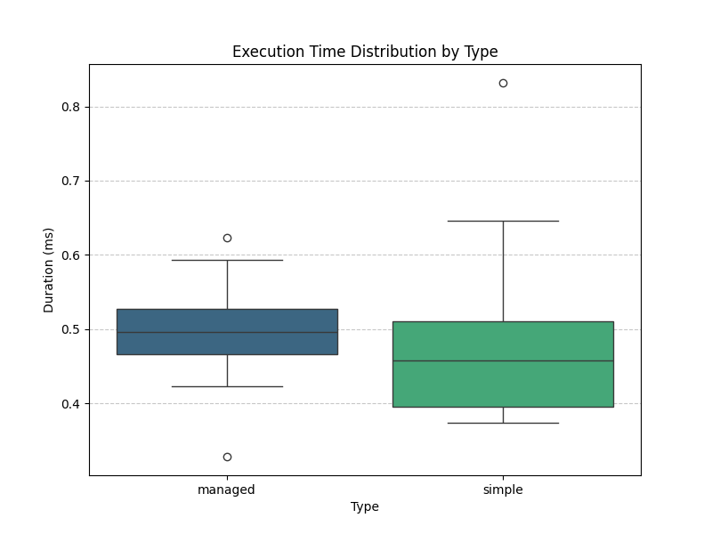

# Managed Environment Profiling

Introduction
------------

An experiment was run to measure the overhead of the managed context for
the `blpconngo` library. In the managed environment there two points
with overhead: (a) subscription process and (b) extending the
macroeconmic events with reference data.

This experiment was focused on the subscription process. It was measure
the time since the subscription was sent until the moment a log message
was received indicating that the subscription was successful. It is
important to notice that period includes the delay in the communication
channel and the response processing time in the server.

Methodology
-----------

* A Go program was written to execute the two kind of subscriptions:
  managed and simple (it is located in `./go/profiler/main.go`).
* This program implements a simplified notification handler that only
  catches log messages.
* If the message is a subscription success report, then the elapsed time
  is estimated.
* To repeat the process, a bash script was written to filter the output
  and saved the results into a file (`output.txt`).
* The experiment was run 25 times.
* A Python script was written to summarize the results.

Results
-------

Times are reported in milliseconds.

| Type    | count   | mean     | std       | min      | 25%      | 50%      | 75%      | max      |
|:--------|:--------|:---------|:----------|:---------|:---------|:---------|:---------|:---------|
| managed | 25      | 0.499855 | 0.0648325 | 0.328106 | 0.4656   | 0.495705 | 0.527442 | 0.623193 |
| simple  | 25      | 0.480881 | 0.109816  | 0.374018 | 0.394977 | 0.457602 | 0.510921 | 0.831958 |

It should note that the managed subscription tends to be greater than
the simple subscription by 0.018 in average for this experiment. On the
other hand, the variability on subscription times tend to be less for
the managed context.

Performing a Welch's two sample t-test:

- t-statistic: 0.7439
- Degress of freedom (approx.): 38.92
- p-value: 0.4614

It is observed that the p-value is to high to reject the hypotesis that
there is no difference between the means of the two cases. In
consequence, the difference is not statistically significant.

